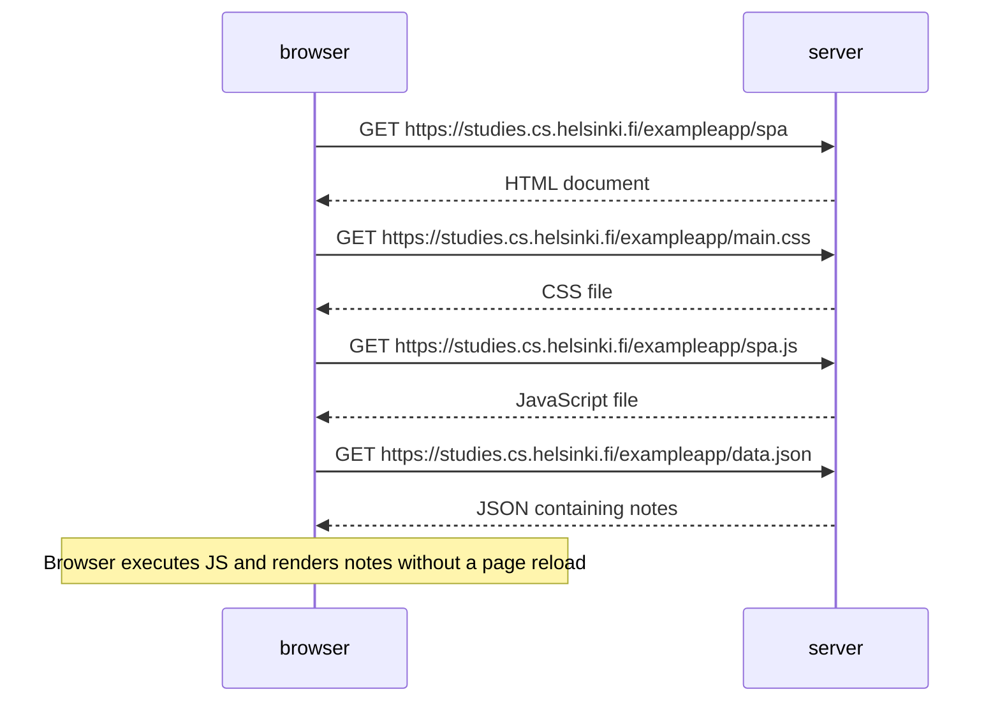

# Exercise 0.5 — Single-page app

```mermaid
sequenceDiagram
    participant browser
    participant server

    browser->>server: GET https://studies.cs.helsinki.fi/exampleapp/spa
    server-->>browser: HTML document
    browser->>server: GET https://studies.cs.helsinki.fi/exampleapp/main.css
    server-->>browser: CSS file
    browser->>server: GET https://studies.cs.helsinki.fi/exampleapp/spa.js
    server-->>browser: JavaScript file
    browser->>server: GET https://studies.cs.helsinki.fi/exampleapp/data.json
    server-->>browser: JSON containing notes
    Note over browser: Browser executes JS and renders notes without a page reload
```
